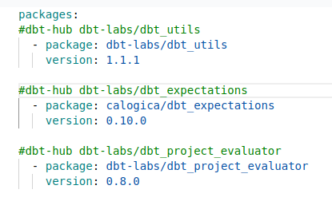
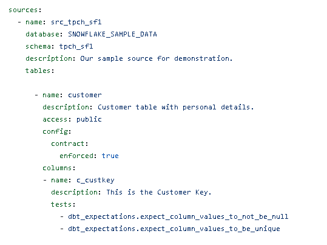
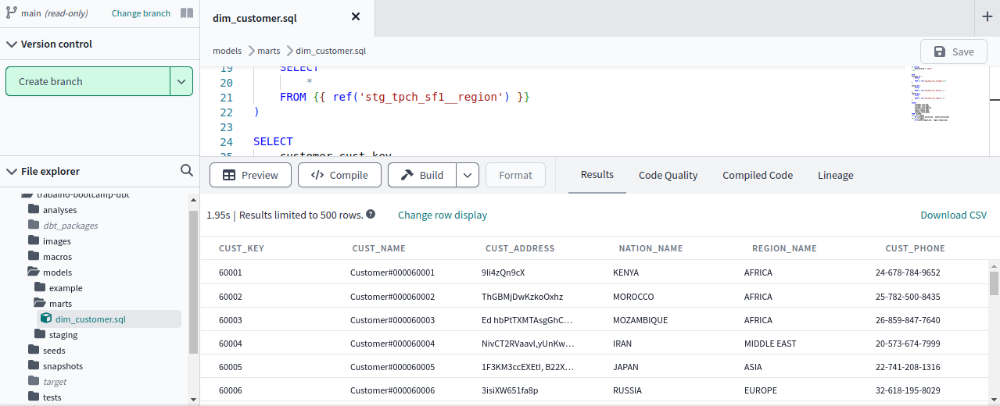
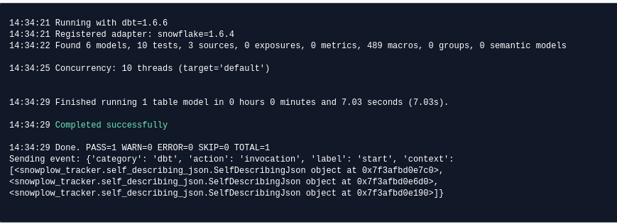
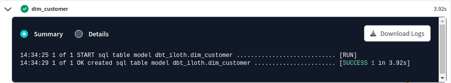
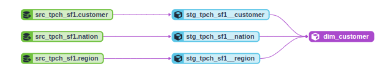
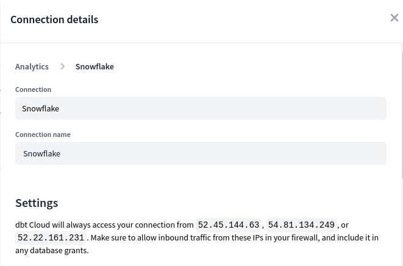

# trabalho-bootcamp-dbt

O objetivo desse projeto é criar um pipeline completo, utilizando ferramentas atuais de mercado como Snowflake e DBT. Utilizando ferramentas do DBT HUB e boas práticas de governança, modelagem, testes, documentação e etc...

### Requisitos:

O pipeline foi desenvolvido utilizando plataformas cloud dos seguintes ambientes:

- Snowflake
- DBT

# Warehouse:
Ambiente que trás os dados de 3 tabelas da base tpch_sf1 (banco de base teste do Snowflake). 
A seguintes tabelas fazem parte do pipeline de dados do nosso projeto: 

- customer
- nation
- region

#### View's de origem:
   ##### STG_TPCH_SF1__CUSTOMER

   ##### STG_TPCH_SF1__NATION

   ##### STG_TPCH_SF1__REGION

#### dim_customer para load dos dados 

   ##### DIM_CUSTOMER

### dbt hub
Buscando melhorias de teste, performance, documentação, organização e por ai vai... O dbt fornece boas praticas e libs para configurar e melhorar seu projeto.

   ##### packages 

   
### source
Algumas práticas de melhorias no projeto aplicadas no arquivo sources.yml

# Execução:
O resultado esperado é join dos dados entre as 3 tabelas do nosso source (snowflake).

#### dim_customer:

#### logs de execução:

# Modelagem
Assim é a modelagem final do nosso projeto.

# Configuração Snowflake

Configuramos uma conexão com o Snowflake usando uma cloud AWS como base.

   #### Adicionando a conexão

