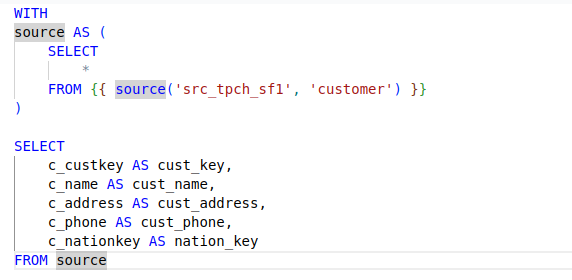
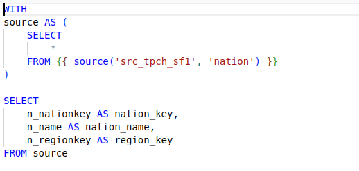
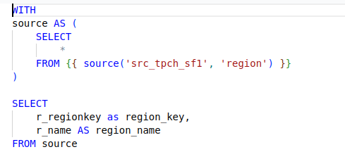
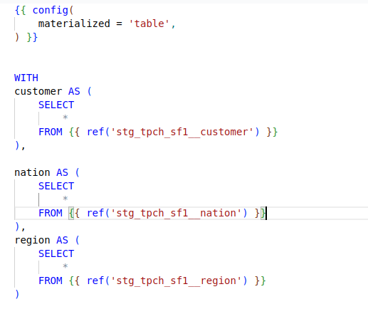
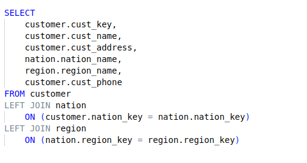

# trabalho-bootcamp-dbt

### O objetivo desse projeto é criar um pipeline completo, utilizando ferramentas atuais de mercado como Snowflake e DBT. Utilizando ferramentas do DBT HUB e boas práticas de governança, modelagem, testes, documentação e etc...

### Requirements:

O pipeline foi desenvolvido utilizando plataformas cloud, sendo assim é necessario contas de acesso nos seguintes ambiente:

- Snowflake
- DBT

### WHAREHOUSE:

#### View's de origem:
   ##### STG_TPCH_SF1__CUSTOMER

   ##### STG_TPCH_SF1__NATION

   ##### STG_TPCH_SF1__REGION

##### Tabela dimensão para load

   ##### DIM_CUSTOMER

### Transformação:
 
     dim_customer.sql

    
    Logs:

### Configuração Snowflake

   ### Adicionando a conexão

